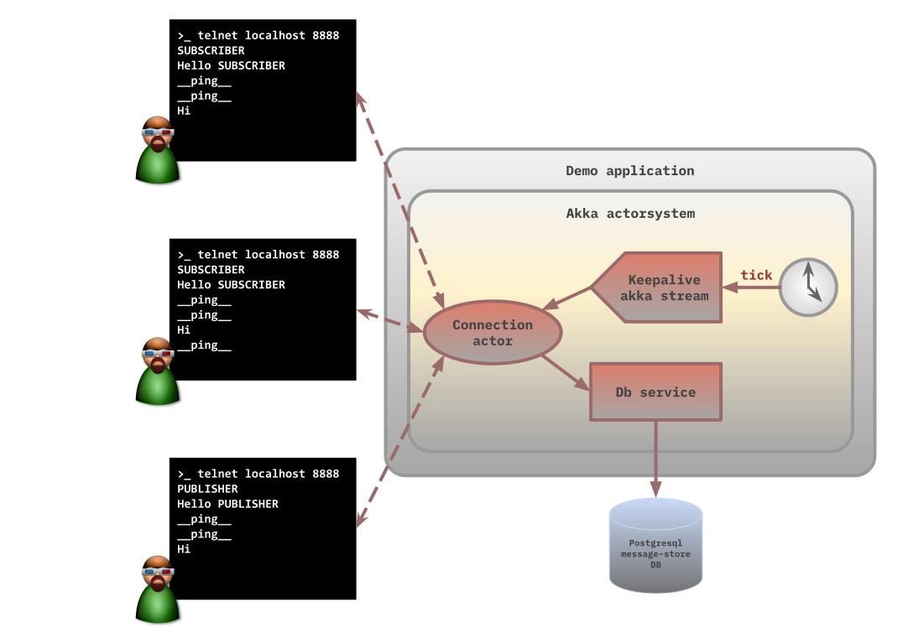

# Demo application

The demo application simulates textual communication between users the TCP protocol. 
The users can be either publishers or subscribers. Messages sent by publishers are received 
by subscribers. After establishing a connection, it becomes clear whether the connecting party 
is a publisher or a subscriber based on the SUBSCRIBER or PUBLISHER initial message.

The code is written in Kotlin and uses the Akka and Akka Streams frameworks.

### Try out

After starting the program, it can be easily tested, for example, with the telnet application.

Start telnet on a console window then type PUBLISHER
```shell
// TERMINAL 1

telnet localhost 8888
Trying 127.0.0.1...
Connected to localhost.
Escape character is '^]'.
PUBLISHER
Hello PUBLISHER
Welcome guys
```

Start another telnet on a different console window then type SUBSCRIBER

```shell
// TERMINAL 2

telnet localhost 8888
Trying 127.0.0.1...
Connected to localhost.
Escape character is '^]'.
SUBSCRIBER
Hello SUBSCRIBER
__ping__
Welcome guys
```

Type something on the first terminal and the text will appear in the other one.

🔔 Time to time the server sends ping messages to the participants. 

🔔 You can start as many publishers and subscribers as you want. Messages from any publishers 
will be received by all the subscribers.

### Architecture



The three main components are:

1 Connection actor: receives the incoming connections and stores their atributes (e.g. publisher 
or subscriber).

2 Message sender
3 Message receiver

### Testing

The tests follow the BDD methodology, and for this, I use the Cucumber framework, which describes 
the test scenarios in Gherkin language. It means that the test scenarios can be written by the 
product owner for instance because it doesn't require any programming knowledge. In practice 
these scripts are often written in collaboration with developers.


